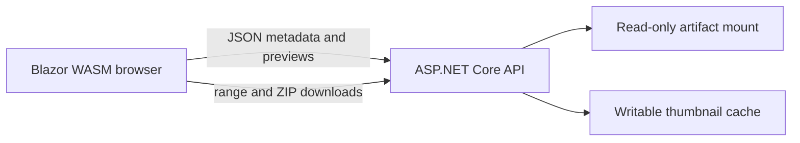

# ArtifactShelf

[](https://github.com/nefarius/ArtifactShelf/actions/workflows/docker-image.yml)
[](https://cursor.com/)

A containerized, **read-only**, [h5ai](https://larsjung.de/h5ai/)-inspired file browser for exposing a
directory of build artifacts, releases, or documentation over HTTP. Built with **.NET 10**, an
ASP.NET Core host, and a **Blazor WebAssembly** frontend — the browser owns all UI state in the
client, while a small set of stateless, hardened server endpoints expose only the mounted artifact
tree and bounded derived content (previews, thumbnails, ZIP downloads).



There is **no upload, edit, or delete functionality** — this is intentionally a one-way window
onto an existing, read-only artifact tree.

## Project layout

| Path | Purpose |
| --- | --- |
| `src/ArtifactBrowser` | ASP.NET Core host: configuration, the hardened file-service API, static asset hosting. |
| `src/ArtifactBrowser.Client` | Blazor WebAssembly frontend: the h5ai-style browsing/preview UI, all client-side state. |
| `tests/ArtifactBrowser.Tests` | xUnit unit + integration tests for path confinement, previews, archives, and API behavior. |
| `sample-data/` | Small sample artifact tree used for local development (mounted as the content root). |
| `Dockerfile`, `.dockerignore`, `compose.example.yml` | Container build and example deployment. |

## Configuration

All configuration lives under the `ArtifactBrowser` section of
[`src/ArtifactBrowser/appsettings.json`](src/ArtifactBrowser/appsettings.json) and can be
overridden with environment variables using the standard ASP.NET Core double-underscore
convention, e.g. `ArtifactBrowser__ContentRoot=/data`.

| Key | Default | Description |
| --- | --- | --- |
| `ContentRoot` | `/data` | Read-only artifact tree root that is browsed. |
| `CacheRoot` | `/cache` | Writable cache root, used only for generated thumbnails. |
| `HiddenPatterns` | `.*`, `Thumbs.db`, `desktop.ini`, `@eaDir`, `$RECYCLE.BIN`, `System Volume Information` | Glob patterns (matched per path segment) hidden from listings, the sidebar tree, and search. A known file URL still downloads, including dotfile sidecars. |
| `MaxTextPreviewBytes` | `1048576` (1 MiB) | Max bytes read for a text/Markdown preview; larger files report `TooLarge`. |
| `MaxDirectoryEntries` | `20000` | Max entries returned per directory listing. |
| `MaxTreeDepth` | `64` | Max recursion depth for the sidebar tree. |
| `MaxSearchResults` | `2000` | Max results returned from a recursive search. |
| `MaxSearchDepth` | `64` | Max recursion depth while searching. |
| `MaxArchiveEntries` | `5000` | Max files allowed in a single ZIP download. |
| `MaxArchiveBytes` | `5368709120` (5 GiB) | Max total uncompressed bytes allowed in a single ZIP download. |
| `MaxConcurrentThumbnails` | `4` | Max concurrent thumbnail-generation jobs. |
| `MaxConcurrentZipJobs` | `2` | Max concurrent ZIP-streaming jobs. |
| `ThumbnailMaxDimension` | `256` | Longest edge, in pixels, of generated thumbnails. |
| `ThumbnailJpegQuality` | `80` | JPEG quality used when encoding thumbnails. |
| `ThumbnailCacheMaxAgeDays` | `30` | How long a cached thumbnail remains valid before being regenerated. |
| `DirectoryListingCacheSeconds` | `5` | How long directory listings may be served from a short-lived in-memory cache. |
| `DefaultViewMode` / `DefaultSortField` / `DefaultSortDescending` / `DefaultItemSize` | `Details` / `Name` / `false` / `Medium` | Initial UI defaults; the browser persists the user's own choices to `localStorage` afterwards. |

Public HTTP endpoints under `/api/files/*` are also protected by fixed-window rate limiting
(120 req/10s general, 20 req/30s for thumbnails and ZIP archives per client IP) to bound abuse.
Rate limiting partitions on `Connection.RemoteIpAddress`, which is the forwarded client IP
when the host sits behind a trusted reverse proxy (see [Reverse proxy](#reverse-proxy-traefik)).

Host bootstrap (Serilog, W3C access logs, and forwarded headers) comes from
[`Nefarius.Utilities.AspNetCore`](https://github.com/nefarius/Nefarius.Utilities.AspNetCore).
Those settings live outside the `ArtifactBrowser` section:

| Key | Default | Description |
| --- | --- | --- |
| `WebApplicationBuilderOptions:W3C:RetainedFileCountLimit` | `3` | Uncompressed W3C access-log files to keep. |
| `WebApplicationBuilderOptions:W3C:RetainedCompressedFileCountLimit` | `90` | Compressed W3C archives to keep. |
| `WebApplicationBuilderOptions:Forwarding:AutoDetectPrivateNetworks` | `true` | Treat detected private/Docker networks as trusted proxies. |
| `WebApplicationOptions:UseForwardedHeaders` | `true` | Honor `X-Forwarded-*` so logs and the rate limiter see the real client IP. |
| `WebApplicationOptions:UseSerilogRequestLogging` | `false` | Also write one Serilog line per HTTP request. |

Serilog writes rolling `server-*.log` files and W3C writes `access-*` files under
`logs/` in the application root (`/app/logs` in the container). Override sinks or
retention with environment variables, e.g.
`WebApplicationBuilderOptions__W3C__RetainedFileCountLimit=12`. Keep the Microsoft
`Logging` section as a fallback; Serilog is the active logger once `Setup()` runs.

## Local development

Requires the [.NET 10 SDK](https://dotnet.microsoft.com/download).

```powershell
dotnet run --project src/ArtifactBrowser
```

By default, `appsettings.Development.json` points `ContentRoot`/`CacheRoot` at the bundled
[`sample-data/`](sample-data) folder and a local `.cache/` folder (both relative to the repo root),
so you can browse sample content immediately at `http://localhost:5289` (or whatever port
`dotnet run` selects). Drop your own files into `sample-data/` to try real content.

The toolbar can increase, decrease, or reset **page zoom** (text and icon size, 80–200%,
like display scaling). The chosen level is stored in `localStorage` as
`artifact-browser.ui-scale` and applied on first paint.

A URL whose path equals the artifact virtual path is a direct download — the same as the old
h5ai-style host. `curl`, CI scripts, and `HttpClient` can fetch
`/builds/HidHide/latest/bin/Release/x64/HidHideClient.exe` (or a hidden sidecar such as
`.HidHideClient.exe.json`) and receive the file bytes. A directory URL still opens the
browser UI.

Run the test suite:

```powershell
dotnet test tests/ArtifactBrowser.Tests
```

## Docker / Compose deployment

Build and run the container:

```bash
docker build -t artifact-browser .
docker run --rm -p 8080:8080 \
  -v /path/to/your/artifacts:/data:ro \
  -v artifact-browser-cache:/cache \
  artifact-browser
```

Or use the annotated example Compose file, which also shows Traefik labels:

```bash
cp compose.example.yml compose.yml
# edit the volume paths, hostname, and Traefik labels for your environment
docker compose up -d --build
```

Key points:

- **`/data` must be mounted read-only** (`:ro`). The app never writes to it.
- **`/cache` must be writable** by the container's non-root user (UID **1654**, matching the
  `mcr.microsoft.com/dotnet/aspnet` convention). If you bind-mount a host directory instead of a
  named volume, `chown -R 1654:1654 /path/on/host` it first, or simply use a named Docker volume
  (as in `compose.example.yml`) and let Docker manage ownership.
- **`/app/logs` is optional but recommended** so Serilog/W3C files survive container recreation.
  Bind-mounts (e.g. `./logs:/app/logs`) need the same UID **1654** ownership as `/cache`.
- The container listens on port **8080** and exposes `GET /health` for container/orchestrator
  health checks (already wired into the `Dockerfile`'s `HEALTHCHECK` and the Compose example).
- Set `TZ` (e.g. `TZ=Europe/Vienna`) to control the timezone used for displayed timestamps and
  log output.
- The image runs as a **non-root** user and is built via a multi-stage Dockerfile (SDK image for
  build/publish, minimal ASP.NET runtime image for the final stage).

### Reverse proxy (Traefik)

`compose.example.yml` includes Traefik v3 router/service labels following the same conventions
used for other services behind `buildbot.nefarius.at` — adjust the router name, `Host()` rule,
entrypoint, and cert resolver labels to match your Traefik instance. The app itself does not
need to know about TLS or the external hostname; it only needs the reverse proxy to forward to
port `8080`.

`Nefarius.Utilities.AspNetCore` enables forwarded headers and auto-detects private/Docker
networks, which is what Traefik on the Compose `web`/`traefik` network needs. After that,
`X-Forwarded-For` / `X-Forwarded-Proto` populate `Connection.RemoteIpAddress` for Serilog, W3C
logs, and the rate limiter. **Do not enable forwarded headers if the container is published
directly to the Internet** — clients could spoof those headers. To turn them off, set
`WebApplicationOptions__UseForwardedHeaders=false` (and typically
`WebApplicationBuilderOptions__Forwarding__AutoDetectPrivateNetworks=false`).

## Security & hardening notes

- **Path confinement**: every incoming path is canonicalized and validated to stay within
  `ContentRoot`; traversal segments (`..`), null bytes, and symlinks that resolve outside the
  root are rejected (`src/ArtifactBrowser/Features/Files/PathGuard.cs`).
- **Hidden entries**: names matching `HiddenPatterns` are excluded from listings, the sidebar
  tree, and search results. Direct file URLs (and `/api/files/raw`) still download an
  existing file even when a path segment is hidden.
- **No physical paths are ever exposed** to the client — all API responses and URLs use
  root-relative virtual paths.
- **Bounded work**: directory entries, tree depth, search results/depth, text preview size, and
  ZIP archive entry count/total size are all capped by configuration; thumbnail generation and
  ZIP streaming both run under a bounded `SemaphoreSlim` so a burst of public traffic can't
  exhaust CPU, memory, or disk.
- **Read-only source data**: thumbnails are written only under `CacheRoot`; ZIP archives are
  streamed directly to the HTTP response and never buffered into the artifact tree or to disk.
- **Markdown safety**: Markdown previews are rendered client-side with raw HTML explicitly
  disabled (Markdig's `DisableHtml()`), so embedded `<script>`/HTML in artifact Markdown cannot
  execute.
- **Range/conditional requests**: raw file and thumbnail responses support HTTP range and
  conditional (`Last-Modified`) requests, so media scrubbing and resumable downloads work as
  expected.

## Operational updates

- Bump the base images in `Dockerfile` (`mcr.microsoft.com/dotnet/sdk:10.0` /
  `mcr.microsoft.com/dotnet/aspnet:10.0`) periodically for security patches; both are pinned to
  the `10.0` minor tag so patch releases are picked up automatically on rebuild.
- The thumbnail cache in `/cache` is safe to delete at any time — it will be regenerated
  on demand (bounded by `MaxConcurrentThumbnails`).
- Because the app is stateless (no database, no session state), scaling out is just a matter of
  running multiple replicas against the same read-only `/data` mount; each replica can use its
  own `/cache` volume.
