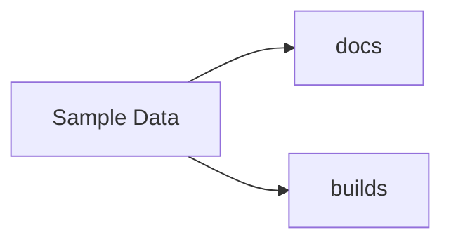

# Sample Artifacts

This folder contains sample content used for local development of the Artifact Browser.
It is mounted as the read-only content root (`/data`) when running the app locally.

## Highlights

- Nested folders to exercise the sidebar tree and breadcrumb navigation
- A few text and Markdown files for preview testing
- Placeholder notes for images/audio/video (add real media files locally if you want to test those previews)

Enjoy browsing!
